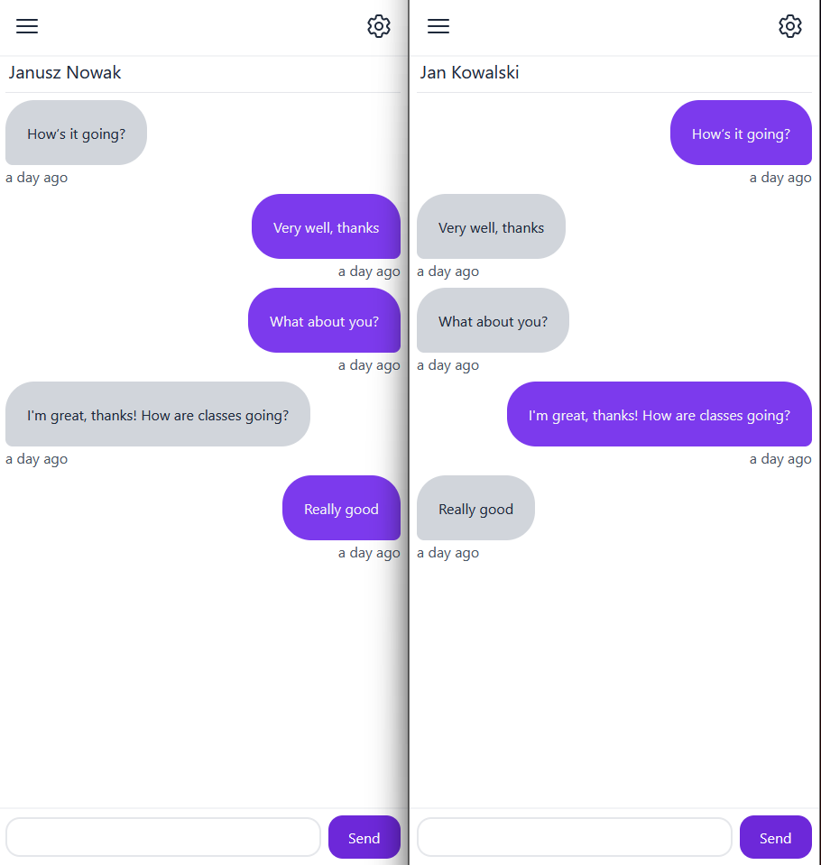
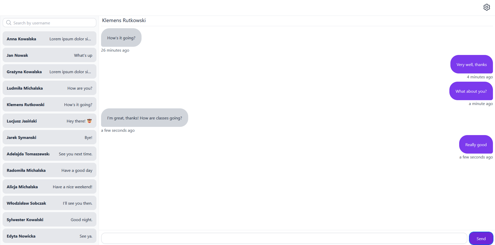
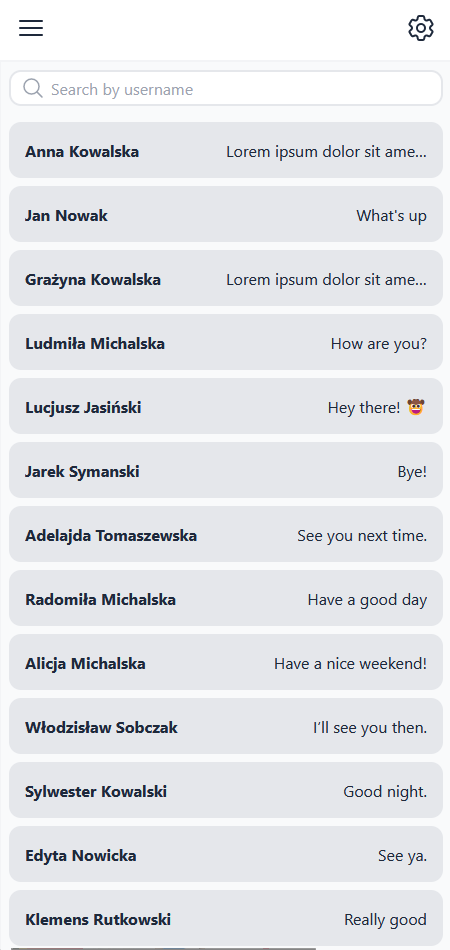
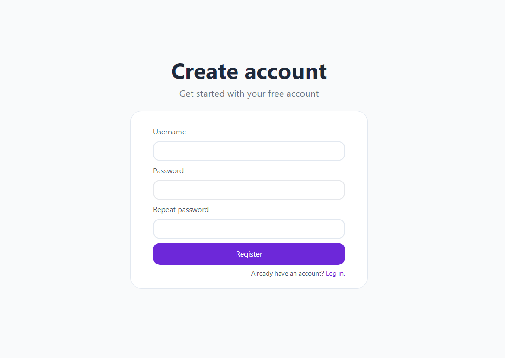

## Messaging app
---
An app that allows real time communication using websockets on all devices.

The users can:
- search for a given user and start a conversation
- create an account
- delete an account
- log out

Authorization was made using JWT and authentication is custom. I used paging and
infinite scrolling design to load messages.

## Technologies
---
- React
- ASP .NET Core 6.0
- Tailwind CSS
- RTK Query
- Typescript

## Installation and Setup Instructions
---
### React
Clone down this repository. You will need `node` and `npm` installed globally on your machine.

Installation:

`npm install`

Starting server:

`npm start`
